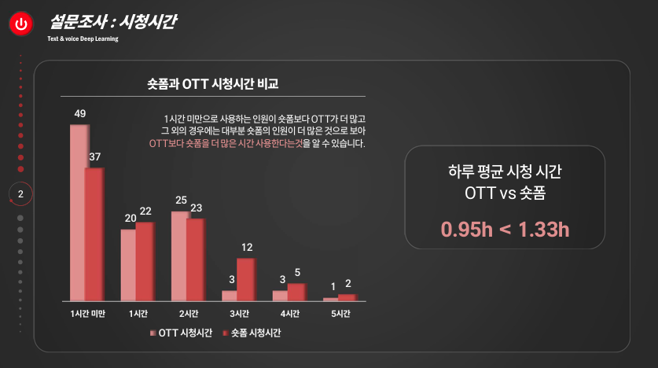
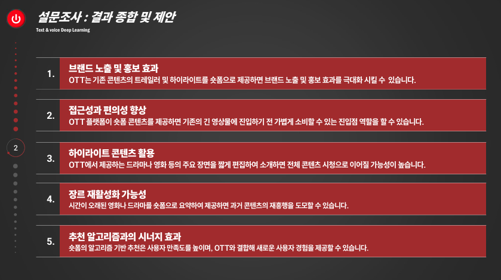
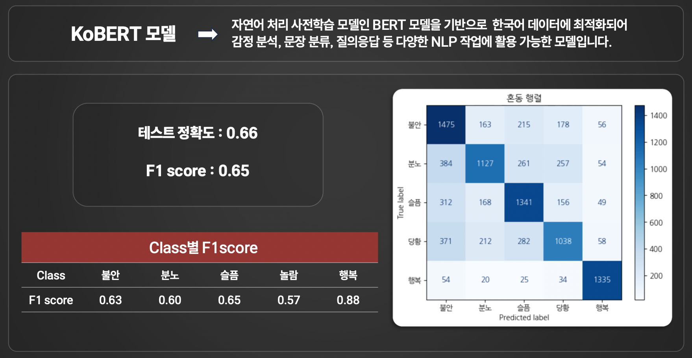
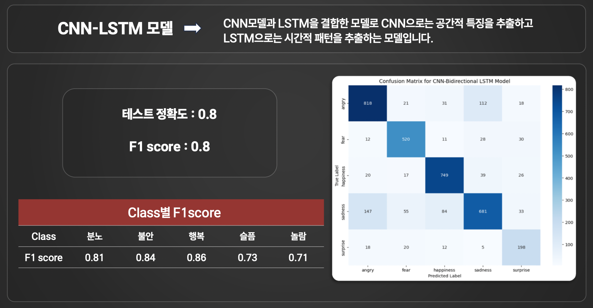
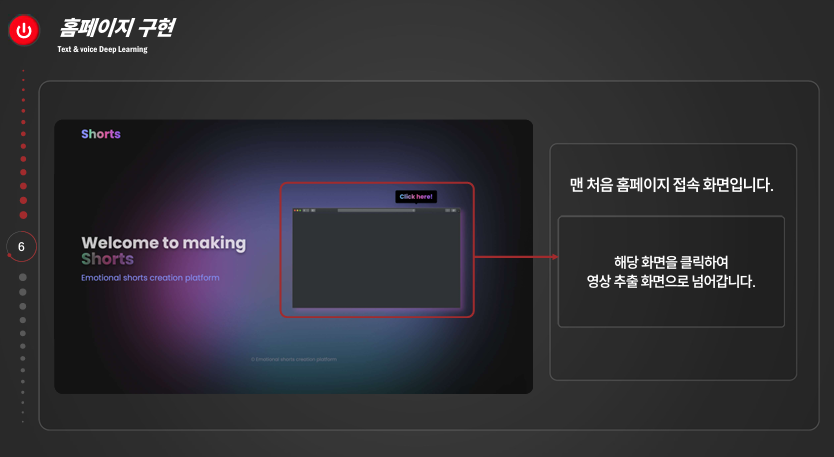
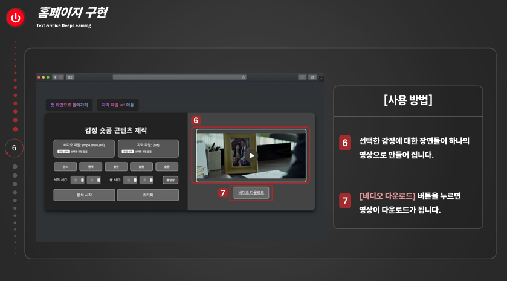

# 🌟 파이썬 딥러닝 Project : 음성 · 텍스트 기반 감정 숏폼 콘텐츠 제작

### 프로젝트 발표 자료
- 프로젝트의 전체 내용은 아래 PDF 파일에서 확인할 수 있습니다. 
 
  👉 [발표 자료 다운로드 - pdf](https://github.com/Kim-Jun-Hee/project5/blob/main/파이썬딥러닝포트폴리오.pdf)
  
📥 **다운로드 안내**  
💡 **PDF**: 오른쪽 상단의 다운로드 버튼을 누르면 다운로드가 가능합니다.  
  

[영상 보기](https://github.com/Kim-Jun-Hee/project5/blob/main/movie1.mp4)

### 📂 프로젝트 목표
- OTT 시장과 숏폼 시장의 성장 추이 및 현재 대중의 인식 조사
- 음성과 텍스트 데이터를 활용한 감정 분석 모델 제작
- 감정 분석 결과를 기반으로 특정 감정에 맞는 영상 클립을 제공하는 홈페이지 제작
  

### 📅 프로젝트 기간
- 2024.10.28 ~ 2024.11.18
  

### 프로젝트 인원 및 역할
- 총인원: 2명
- 개인 작업: 음성 데이터를 활용한 감정 분석 모델 제작,숏폼 제작 홈페이지 구현,발표 준비
- 공동 작업: 데이터 전처리
  

### 사용된 기술 및 도구

#### 💻 주요 기술
 **python**(TensorFlow,keras,sklearn,kobert_tokenizer..)

#### 🛠️ 도구 

  
  
  
  
  
  

### 🏆 주요 결과물
<table>
  <tr>
    <td align="center">🌟 OTT와 숏폼에 대한 설문조사 - 사용시간</td>
    <td align="center">🌟 OTT와 숏폼에 대한 설문조사 결과</td>
  </tr>
  <tr>
    <td>
      
    </td>
    <td>
      
    </td>
  </tr>
  <tr>
    <td align="center">🌟 텍스트 감정 분석 모델 생성</td>
    <td align="center">🌟 음성 감정 분석 모델 생성</td>
  </tr>
  <tr>
    <td>
      
    </td>
    <td>
      
    </td>
  </tr>
  <tr>
    <td align="center">🌟 숏폼 제작 홈페이지 구현 - 시작 화면</td>
    <td align="center">🌟 숏폼 제작 홈페이지 구현 - 다음 화면</td>
  </tr>
  <tr>
    <td>
      
    </td>
    <td>
      
    </td>
  </tr>
</table>
